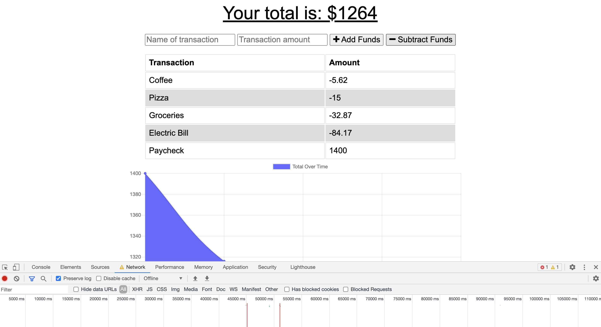
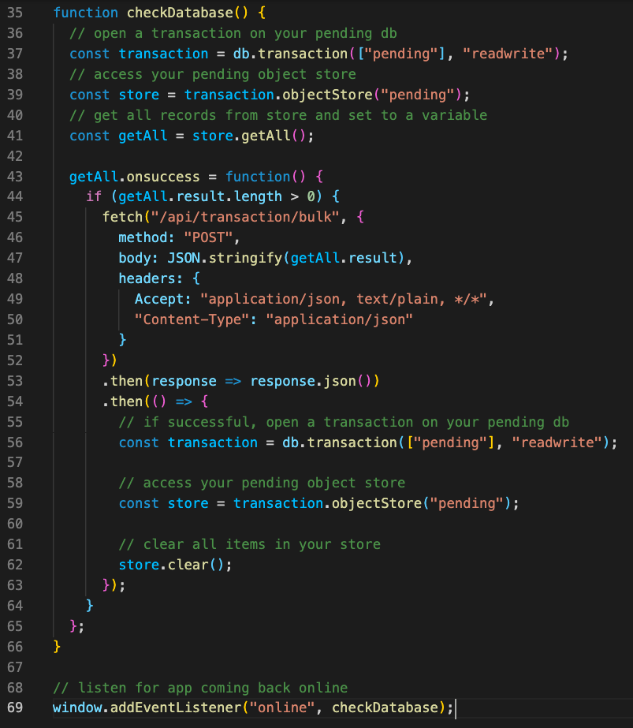

# budget_tracker

# Description

This Budget Tracker App allows the User to keep track of their finances both online and offline.

# Table of Contents

- [Usage](#screenshots)
- [Code](#code)
- [Link](#link)
- [Questions](#questions)
- [License](#license)

## Usage

Any expenses or income the User adds while offline will be cached in the database until the next time the App is online.

## Code

When the App comes back online, the cached data will be retrieved and the Budget updated accordingly. After the cached data has been successfully added, the database will be cleared.

## Link

Link to the deployed site: [Budget Tracker](https://fathomless-river-30495.herokuapp.com/)

## Questions

If you have any questions, please contact me at jenLkelly@gmail.com.  
You can also visit my [Github Page](https://github.com/jkelly101).

## License

- https://choosealicense.com/licenses/mit/
